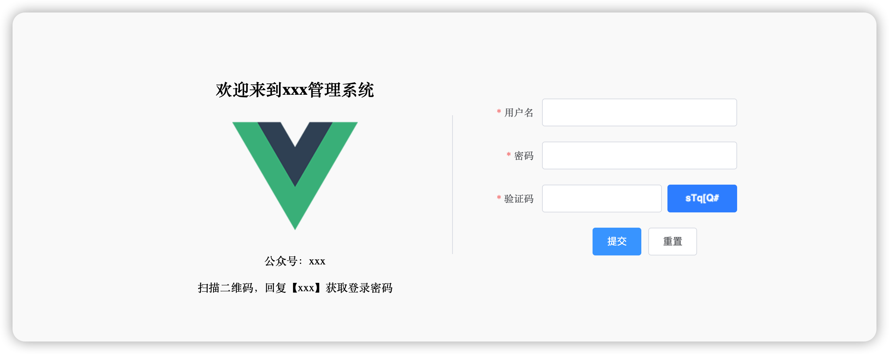
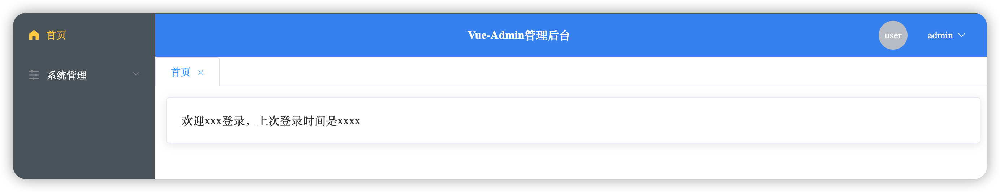
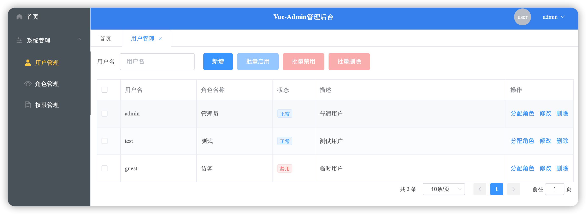
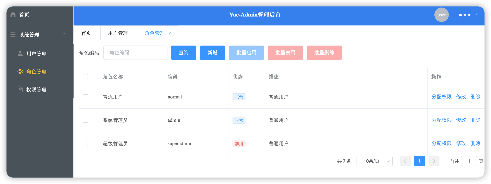

# admin-ui

## Project setup
```
npm install
```

### Compiles and hot-reloads for development
```
npm run serve
```

### Compiles and minifies for production
```
npm run build
```

### Lints and fixes files
```
npm run lint
```
### 参考资料
https://docs.npmjs.com/getting-started

https://cn.vuejs.org/v2/guide/

https://cli.vuejs.org/zh/

https://vuex.vuejs.org/zh/

https://router.vuejs.org/zh/guide/#javascript

https://element.eleme.cn/#/zh-CN/component/installation
### 项目截图




